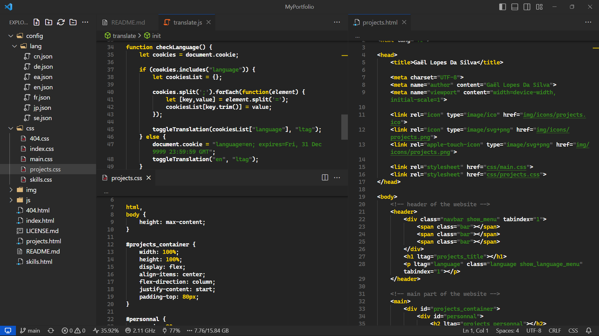
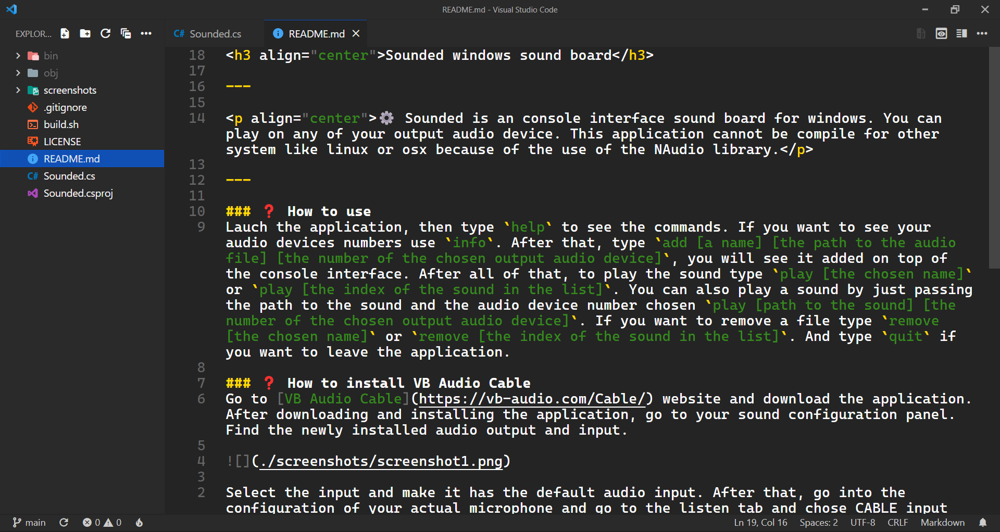
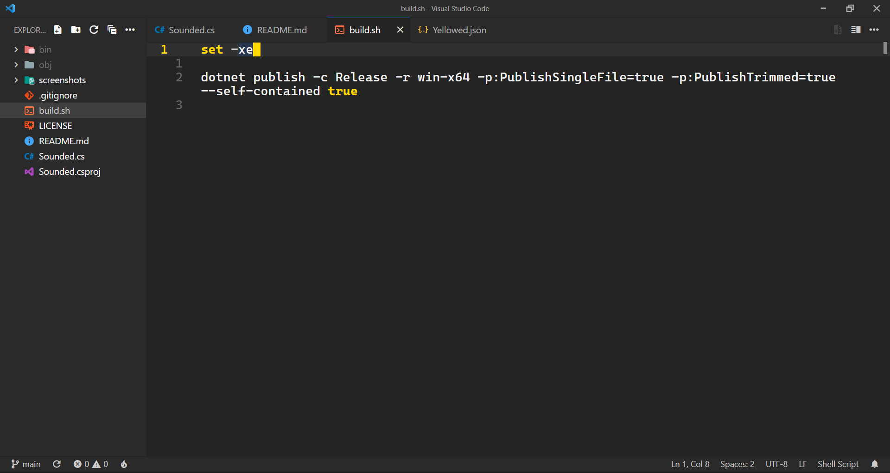

<h3 align="center">
    Yellowed
</h3>

---

> [!NOTE]
> Yellowed is a simple material dark theme wich focus his syntax color on the golden yellow. Its syntax is inspired by the [gruber-darker](https://github.com/rexim/gruber-darker-theme) theme for emacs, but changed a bit. The interface color is clearly stealed (maybe not :p) from the [Accent Monokai](https://marketplace.visualstudio.com/items?itemName=tw.monokai-accent) theme, the blue one.

> [!IMPORTANT]
> If you find any weird syntax highlighting, please report it [here](https://github.com/Gael-Lopes-Da-Silva/YellowedVSCode/issues/new/choose). This would help me a lot since I can't cover all the languages.

---

    
    
    
    
    

### :framed_picture: Screenshots

### :bricks: How to build ?
If you want a build of Yellowed you can find it in the [build](./build/) folder.
Else, use the `build.js` file to build the theme.

### :question: How to install ?
To install, open visual studio code and go to the extention menu. Click on the three dots and click on `Install from VSIX` and choose the `yellowed-X.X.X.vsix` file.

### :gear: Color palet
~~~
Interface
Blue      - [#1050b5]
Gray      - [#2a2a2a]
Dark Gray - [#242424]

Syntaxe
Grey      - [#6b6b6b]
Green     - [#378b1d]
Purple    - [#ff80f4]
Yellow    - [#ffd900]
White     - [#ffffff]
~~~

> [!NOTE]
> You can find my Visual Studio Code configuraton [here](https://github.com/Gael-Lopes-Da-Silva/MyVscodeConfig).
