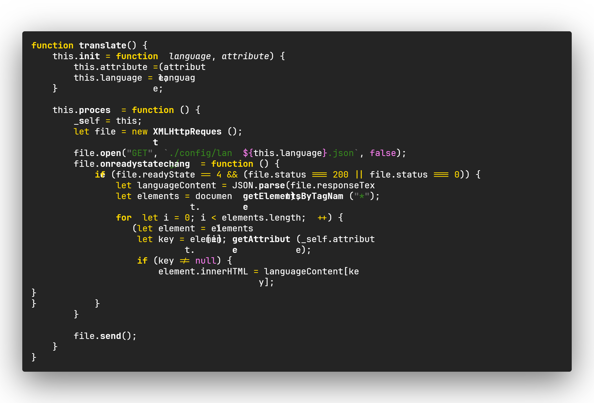
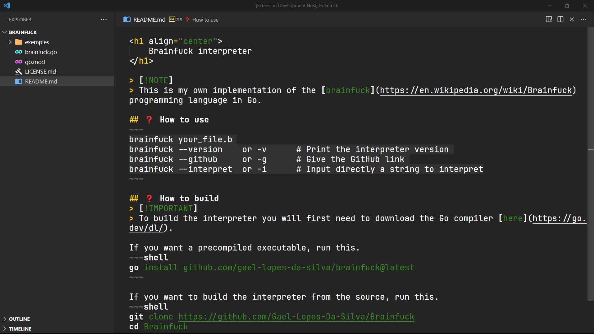
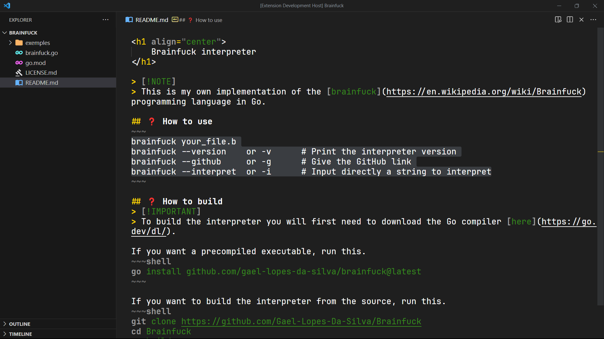

<h1 align="center">
    Yellowed
</h1>

    
    
    
    
    

<!-- > 🗒️ -->
> [!NOTE]
> Yellowed is a simple material dark theme wich focus his syntax color on the golden yellow. Its syntax is inspired by the [gruber-darker](https://github.com/rexim/gruber-darker-theme) theme for emacs, but changed a bit.

<!-- > ❗ -->
> [!IMPORTANT]
> If you find any weird syntax highlighting, try disabling semantic highlighting. If it doesn't work then please report it [here](https://github.com/Gael-Lopes-Da-Silva/YellowedVSCode/issues/new/choose). This would help me a lot since I can't cover all the languages.

## 🖼️ Screenshots
### Yellowed

### Yellowed Reborn

## 🧱 How to build ?
If you want a build of Yellowed you can find it in the [build](./build/) folder.

## ❓ How to install ?
To install, open visual studio code and go to the extention menu. Click on the three dots and click on `Install from VSIX` and choose the `yellowed-X.X.X.vsix` file.

## ⚙️ Color palet
~~~
Syntax
Gray       - [#6b6b6b]
Light Gray - [#9b9b9b]
Green      - [#378b1d]
Purple     - [#ff80f4]
Yellow     - [#ffd900]
White      - [#ffffff]
~~~

<!-- > 🗒️ -->
> [!NOTE]
> You can find my Visual Studio Code configuraton [here](https://github.com/Gael-Lopes-Da-Silva/MyVscodeConfig).
