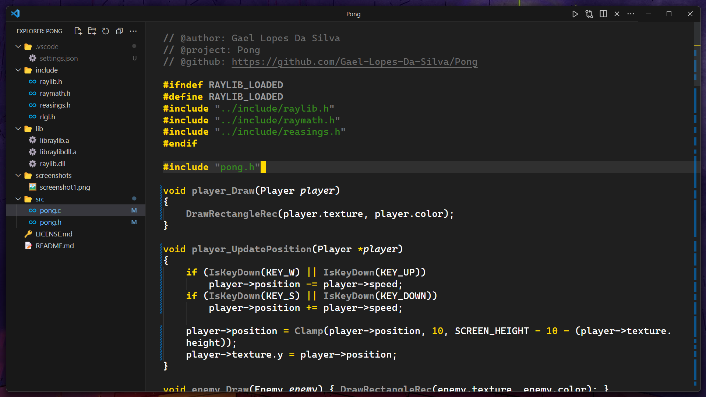

	<h1>Yellowed</h1>

	

    <a href="https://github.com/Gael-Lopes-Da-Silva/YellowedVSCode">https://github.com/Gael-Lopes-Da-Silva/YellowedVSCode</a>

 

	
	
	

	
	

Description
------------------------------------------------------------------

Yellowed is a simple material dark theme wich focus his syntax color on the golden yellow. Its syntax is inspired by the [gruber-darker](https://github.com/rexim/gruber-darker-theme) theme for emacs.

If you find any weird syntax highlighting, try disabling semantic highlighting. If it doesn't work, then please report it [here](https://github.com/Gael-Lopes-Da-Silva/YellowedVSCode/issues/new/choose). This would help me a lot since I can't cover all the languages.

If you want to help me add more icons, you can suggest things to me [here](https://github.com/Gael-Lopes-Da-Silva/YellowedVSCode/issues/new/choose).

Screenshots
------------------------------------------------------------------

> ### Yellowed Reborn
> 
> 

> ### Yellowed
> 
> 

How to build
------------------------------------------------------------------

If you want a build of Yellowed you can find it in the release section or in the [build](./build/) folder. Else use `vsce package` in the project folder.

How to install
------------------------------------------------------------------

To install, open visual studio code and go to the extention menu. Click on the three dots and click on `Install from VSIX` and choose the `yellowed-X.X.X.vsix` file. Or just install it on the market place.