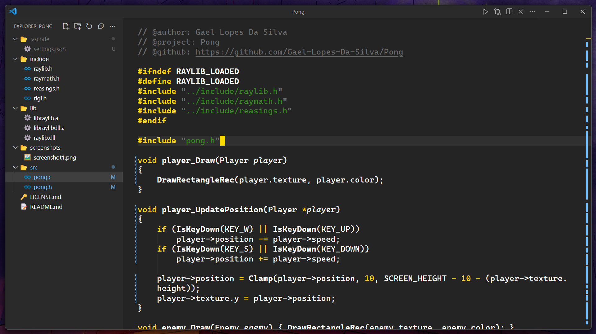

<h1 align="center">
    Yellowed
</h1>

    
    
    
    
    

<!-- > [!NOTE] -->
> 🗒️
> Yellowed is a simple material dark theme wich focus his syntax color on the golden yellow. Its syntax is inspired by the [gruber-darker](https://github.com/rexim/gruber-darker-theme) theme for emacs, but changed a bit.

<!-- > [!IMPORTANT] -->
> ❗
> If you find any weird syntax highlighting, try disabling semantic highlighting. If it doesn't work then please report it [here](https://github.com/Gael-Lopes-Da-Silva/YellowedVSCode/issues/new/choose). This would help me a lot since I can't cover all the languages.

## 🖼️ Screenshots

 
 <h3>Yellowed Reborn</h3> 

 
 <h3>Yellowed</h3> 

## 🧱 How to build ?
If you want a build of Yellowed you can find it in the [build](./build/) folder. Else use `vsce package` in the project folder.

## ❓ How to install ?
To install, open visual studio code and go to the extention menu. Click on the three dots and click on `Install from VSIX` and choose the `yellowed-X.X.X.vsix` file. Or just install it on the market place.

## ⚙️ Color palet
~~~
# interface
gray         = "#1F1F1F"
dark_gray    = "#181818"
light_gray   = "#303030"
smoke        = "#565656"
yellow       = "#FFD900"
purple       = "#994C92"
blue         = "#008DFF"
warning      = "#FF9C00"
error        = "#FF0000"
info         = "#0092FF"
hint         = "#4DFF00"

# syntax
text         = "#FFFFFF"
comment      = "#6B6B6B"
string       = "#378B1D"
constants    = "#FF80F4"
keywords     = "#FFD900"
function     = "#9B9B9B"
~~~

<!-- > [!NOTE] -->
> 🗒️
> You can find my Visual Studio Code configuraton [here](https://github.com/Gael-Lopes-Da-Silva/MyVscodeConfig).
